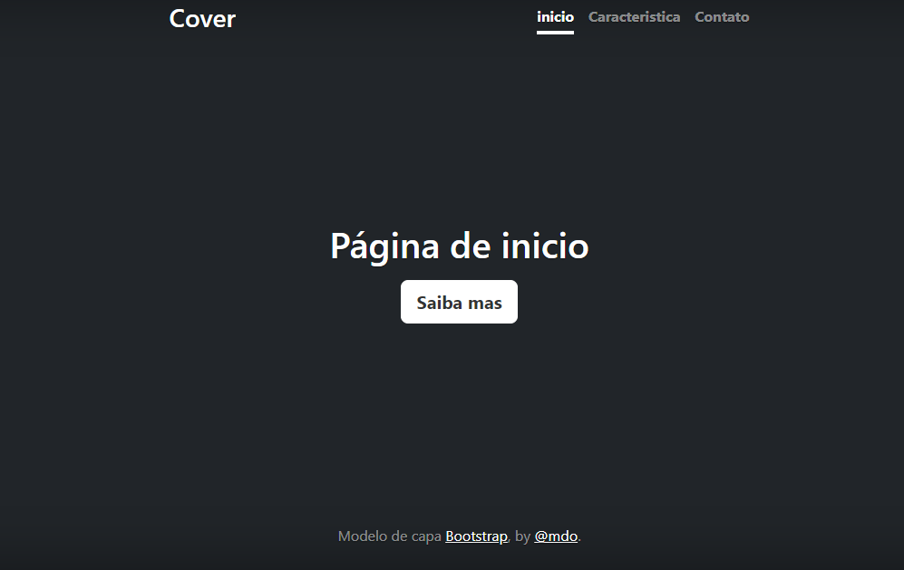

# Indice

[ portifolipessoal](#portifolipessoal)  
[Descrição](#descri%C3%A7%C3%A3o)  
[Introdução](#introdu%C3%A7%C3%A3o)  
[Funcionalidades](#funcionalidades)  
[Tecnologias utilizados](#tecnologias-utilizados)  
[Fontes consultadas](#fontes-consultadas)  
[Autores](#autores)  

# portifolipessoal

PROJETO CRIADO UTILIZADO EXEMPLO DE BOOTSTRAP PARA ENSINO DE USO DO README E DO BOOTSTRAP.

# Descrição
O PROPÓSITO DESTE PROJETO, O OBJETIVO, FOI APRIMORAR AS HABILIDADES TEXTO QUE COMPÕE O README.

# Introdução
O PROJETO FOI APRIMORAR AS HABILIDADES TEXTO QUE COMPÕE O README PARA MELHORAR.
# Funcionalidades
AS FUNÇAO NÃO VÃO NDA ALÉM DA CAPA DO SITE

### Tecnologias utilizados
GIT HUB
VISUAL CODE
HTML
CSS
BOOTSTRAP
## Fontes consultadas
https://gist.github.com/lohhans/f8da0b147550df3f96914d3797e9fb89
https://www.alura.com.br/artigos/escrever-bom-readme
## Autores
FOI CRIADO POR EVELLYN FLAVIANE E AJUDA DO PROFESSOR LEONARDO ROCHA.